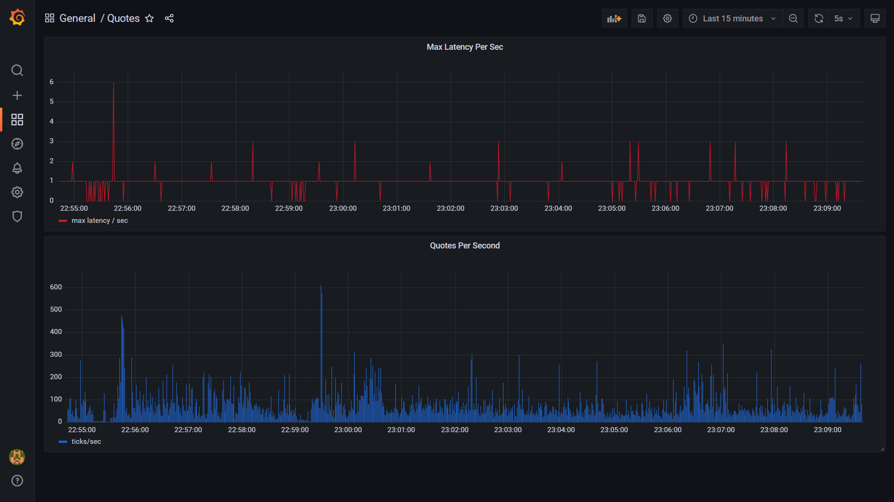

= Broker-marketdata

== New features from branch "grafana":

* Added Grafana
- Added Grafana as part of marketdata docker-compose
- go to section Grafana and follow the instruction to set-up and import the dashboard
* General enhancements
- To reduce Verticles, WebsocketClientVerticle changed to abstract
- Added abstract test classes to simplify code
- Refactored configuration and making database configuration immutable
- publish time now is part of the protoc quote and the storage is stored in progress after the quote is published
- symbol configuration was changed to map to normalize to internal same symbol

== New features from branch "binance":

* Added Binance
- Refactor the Websocket client in order to be reusable
- Created the concept of adapter for Binance and BitMEX
- Split Configuration and quotes Normalization by adapter
- Added unit test for Binance

== New features from branch "springboot-vertx":

* Introduced Spring Boot
- Used to simplify code injecting instances and constructors.
- Simplify configuration.
- Reduce dependencies in POM.
- Verticles are independent and keep communicating asynchronously via the Vertx-Bus.
- JPA+Hibernate to handle the storage.
- Given the amount of quotes that can be stored the database is drop every restart during dev time.
- Added H2 for the unit test.
- Added latency measurement from the time the tick arrives to when it is published, subscribe to ws://localhost:8900/realtime/quotes.
* Original Vertx code in branch "vertx"

== MarketDataService Project Description:

image::MarketDataService.PNG[]

* MarketDataService is used to normalize prices from BitMex to internal quotes.
* It has a client websocket that connects to BitMEX.
* Data received is sent via vertx bus to two topics:

    Topic: raw_data
        * raw quotes recevied from BitMex are logged asynchronous for audit

* Quotes are normalized into a Google Proto Buffer object and this object is sent to a different topic simultaneously:

   Topic: internal_quotes
        * Two components are reading from this topic
        1) StorageVerticle that stores the internal normilized prices
        2) WebsocketServerVerticle, this component publish the mesages to clients
        subscribed for internal use

== Project

=== Building

* Go to <WORKSPACE>/broker_marketdata/

* To launch the tests:

    mvn clean test

* To package the application:

    mvn clean package

* To run/stop the application:

    mvn spring-boot:run
    mvn spring-boot:stop

* To build a new docker image:

    mvn spring-boot:build-image

IMPORTANT: If you run the service locally, you have to deploy PostgreSql first, for more details go to dockers section.

== BitMEX API:

* The service subscribes to BitMEX topic "instrument" and updates are received via Websockets:

    https://www.bitmex.com/app/wsAPI

* Connection to:

    wss://www.bitmex.com/realtime

* Topic:

    "instrument",          // Instrument updates including turnover and bid/ask

* To manage the configuration of the topics it can be changed in the file:

    broker-marketdata/src/main/resources/application.ymal

* In to the property definition:

    ws.client.bitmex.symbol

=== BitMex API Help

    https://www.bitmex.com/app/apiOverview

== Binance API:

* The service subscribes to Binance stream "bookTicker" and updates are received via Websockets:

    wss://stream.binance.com:9443

* Connection to:

    wss://stream.binance.com:9443/ws

* Stream:

    @bookTicker

* To manage the configuration of the topics it can be changed in the file:

    broker-marketdata/src/main/resources/application.ymal

* In to the property definition:

    ws.client.binance.symbol

=== Binance API Help

    https://binance-docs.github.io/apidocs/spot/

== Vertx

image:https://img.shields.io/badge/vert.x-4.2.0-purple.svg[link="https://vertx.io"]

This application was generated using http://start.vertx.io

=== Vertx Help

* https://vertx.io/docs/[Vert.x Documentation]
* https://stackoverflow.com/questions/tagged/vert.x?sort=newest&pageSize=15[Vert.x Stack Overflow]
* https://groups.google.com/forum/?fromgroups#!forum/vertx[Vert.x User Group]
* https://gitter.im/eclipse-vertx/vertx-users[Vert.x Gitter]

== Google Protocol Buffers

=== Building

To build InternalPrice.proto:

* Add the environment variable PROTOC_PATH where protoc in installed.
* Go to terminal in the project and execute

    .\build_protoc.bat

* It will create the relevant classes for InternalPrice.
* InternalPrice is the serialized object that will be sent.
* For debugging you can set the variable serialization:false in the config file

=== Google Protocol Buffers Help

https://developers.google.com/protocol-buffers/docs/javatutorial

== Storage

* Uses PostgreSql to store prices as docker image
* Uses flyway as a database management control

== Docker-compose

=== Building

To deploy the MarketDataService with PostgreSql

* Go to <WORKSPACE>/broker_marketdata/cocker-compose/marketdata
* execute

    docker-compose up -d

To deploy only PostgreSql

* Go to <WORKSPACE>/broker_marketdata/cocker-compose/postgresql
* execute

    docker-compose up -d

== Websocket MarketDataService Test

=== Online client

Once the service is running locally or in a container

* to test the websocket connect using

    https://websocketking.com/
    https://www.piesocket.com/websocket-tester#

* use the following path

    ws://localhost:8900/realtime/quotes

== Grafana

* Once the docker is deployed, use admin/admin to login

=== Datasource configuration

* Go to setting -> Configuration -> Data sources -> Add DataSource
* Search for Postgresql

    Host: database:5432
    Database: marketdata
    User/Password: defined in the yaml file
    TLS/SSL Mode: disable

* Save and test

=== Import Dashboard

* On create (+) -> Import
* Under the new window -> Upload Json file
* Go to

    <WORKSPACE>/broker_marketdata/grafana/DashboardQuotes.json

* Load
* It will crate the dashboard Quotes as follows:

- First section shows max latency per second
- Second section shows number of quotes per second

IMPORTANT: If you run Grafana and Posgresql inside Docker and the MarketdataService in your local PC, the time is shift the timezone

